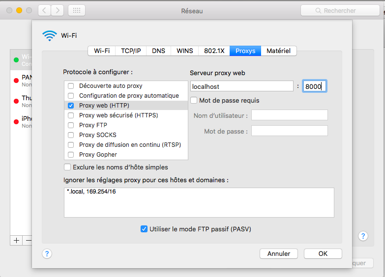
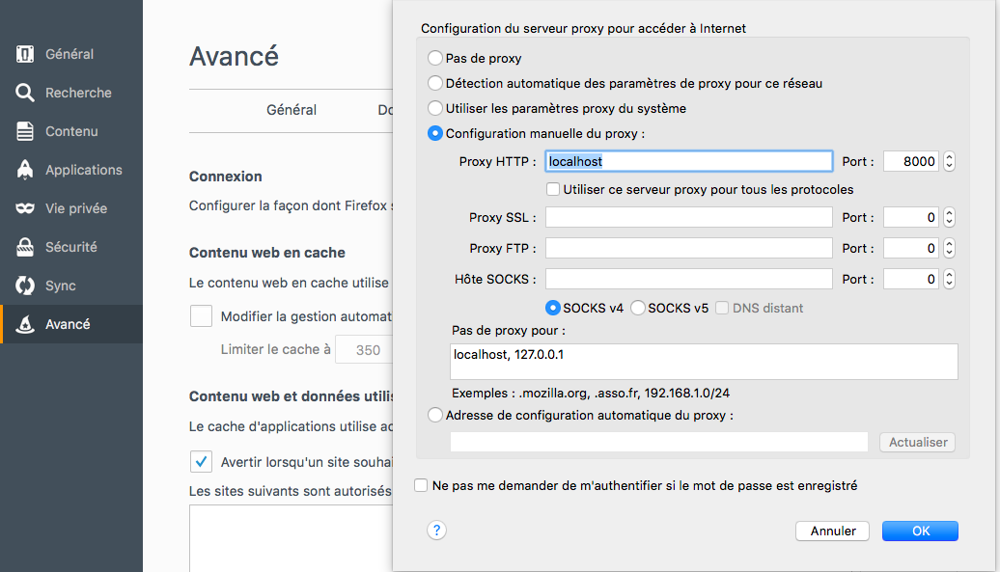

Fast and simple hyperProxy wrapper
==================================

Replace any remote file on any website with local files

Side project of beautiful [hyperProxy](https://github.com/Hypermediaisobar/hyperProxy)

```shell
git clone https://github.com/nicolaslabbe/hyper-proxy-wrapper.git
```

## Dependancies

- node/npm

## Install

```shell
npm install
```

## Run 

```shell
node dynamique.js
```

## Change your proxy configuration

Chrome:

Go to : chrome://settings/ , and change your chrome proxys settings



Firefox :

Go to : about:preferences / advanced / network, and change your firefox proxys settings


## How to replace local file instead of remote file

For example put jquery.js inside "dynamique" folder and jquery.js will be replaced on all visited website, that's it